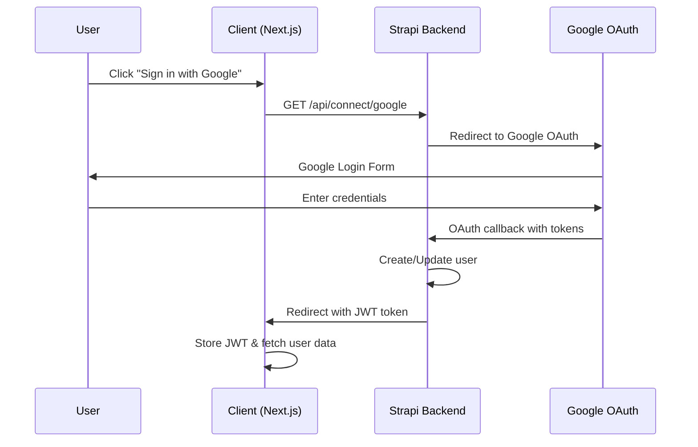

# 📚 **Rhoda Learning Platform - Authentication & Course Management Documentation**

## **Table of Contents**
1. [System Overview](#system-overview)
2. [Authentication Architecture](#authentication-architecture)
3. [Profile Management](#profile-management)
4. [Course Linking System](#course-linking-system)
5. [API Endpoints Reference](#api-endpoints-reference)
6. [Database Schema](#database-schema)
7. [Implementation Guide](#implementation-guide)
8. [Security Considerations](#security-considerations)
9. [Troubleshooting](#troubleshooting)

---

## **1. System Overview**

### **Architecture**
- **Frontend**: Next.js 14 with TypeScript, React Context for state management
- **Backend**: Strapi CMS (Headless) with PostgreSQL/SQLite database
- **Authentication**: JWT-based with Google OAuth integration
- **State Management**: React Context API with localStorage persistence

### **Key Components**
- **AuthContext**: Centralized authentication state management
- **User-Course Relationship**: Many-to-many relationship through junction table
- **Profile Management**: Real-time user data synchronization
- **Course Enrollment**: Automated tracking with timestamps

---

## **2. Authentication Architecture**

### **2.1 Authentication Flow**

#### **Google OAuth Flow**


#### **JWT Token Management**
```typescript
// AuthContext Implementation
interface User {
  id: string
  email: string
  username: string
  provider: string
  confirmed: boolean
  blocked: boolean
  createdAt: string
  updatedAt: string
  role: {
    id: string
    name: string
    description: string
    type: string
  }
}

interface AuthContextType {
  user: User | null
  token: string | null
  isLoading: boolean
  isAuthenticated: boolean
  login: (token: string) => Promise<void>
  logout: () => void
}
```

### **2.2 Authentication Components**

#### **AuthProvider**
- **Location**: `/contexts/AuthContext.tsx`
- **Purpose**: Global authentication state management
- **Features**:
  - JWT token persistence in localStorage
  - Automatic token validation on app load
  - User profile synchronization
  - Session management

#### **Protected Routes**
```typescript
// Authentication Check Pattern
React.useEffect(() => {
  if (!isLoading && !user) {
    router.push('/auth/sign-in')
  }
}, [user, isLoading, router])
```

### **2.3 API Authentication Endpoints**

#### **Google OAuth Initiation**
- **Endpoint**: `GET /api/auth/google`
- **Purpose**: Redirects to Strapi Google OAuth
- **Response**: Redirects to Google OAuth flow

#### **OAuth Callback Handler**
- **Endpoint**: `GET /api/connect/google/redirect`
- **Purpose**: Processes OAuth tokens and creates session
- **Parameters**: `jwt`, `access_token`, `id_token`

#### **User Profile Fetch**
- **Endpoint**: `GET /api/auth/me`
- **Purpose**: Retrieves current user profile
- **Headers**: `Authorization: Bearer <token>`
- **Response**: Complete user object with populated relationships

---

## **3. Profile Management**

### **3.1 Profile Creation Process**

#### **Automatic Profile Creation**
1. **Google OAuth Success** → User record created/updated in Strapi
2. **JWT Token Generated** → Stored in client localStorage
3. **Profile Data Sync** → Real-time fetch from `/api/auth/me`
4. **Context Update** → User state updated across application

#### **Profile Data Structure**
```typescript
interface UserProfile {
  // Core Identity
  id: string
  email: string
  username: string
  
  // Authentication Info
  provider: 'google' | 'local'
  confirmed: boolean
  blocked: boolean
  
  // Timestamps
  createdAt: string
  updatedAt: string
  
  // Role & Permissions
  role: {
    id: string
    name: string
    description: string
    type: string
  }
  
  // Course Relationships (populated)
  user_courses?: UserCourse[]
}
```

### **3.2 Profile Management Features**

#### **Profile Update API**
- **Endpoint**: `PUT /api/auth/update-profile`
- **Purpose**: Updates user profile information
- **Fields**: username, email, profile settings

#### **Password Management**
- **Endpoint**: `POST /api/auth/change-password`
- **Purpose**: Updates user password (for local accounts)
- **Security**: Requires current password verification

#### **Notification Preferences**
- **Endpoint**: `PUT /api/auth/update-notifications`
- **Purpose**: Manages user notification settings
- **Settings**: Email, push, course updates, marketing

---

## **4. Course Linking System**

### **4.1 Database Relationship Model**

#### **User-Course Junction Table**
```json
{
  "kind": "collectionType",
  "collectionName": "user_courses",
  "attributes": {
    "Name": { "type": "string" },
    "enrolledAt": { "type": "date" },
    "course": {
      "type": "relation",
      "relation": "manyToOne",
      "target": "api::course.course",
      "inversedBy": "user_courses"
    },
    "user": {
      "type": "relation",
      "relation": "manyToOne",
      "target": "plugin::users-permissions.user"
    }
  }
}
```

#### **Relationship Diagram**
```
Users (1) ←→ (M) UserCourses (M) ←→ (1) Courses
```

### **4.2 Course Enrollment Process**

#### **Enrollment API Flow**
1. **User Action** → Click "Enroll" on course
2. **Authentication Check** → Verify JWT token
3. **Duplicate Prevention** → Check existing enrollments
4. **Record Creation** → Create user_courses entry
5. **Timestamp Recording** → Set enrolledAt date
6. **Response** → Confirmation with enrollment details

#### **My Courses API Implementation**
```typescript
// /api/my-courses/route.ts - Key Features
async function GET(req: NextRequest) {
  // 1. Authentication verification
  const authHeader = req.headers.get('authorization');
  
  // 2. User identification
  const userData = await fetch(`${strapiUrl}/api/users/me`);
  
  // 3. Course validation (prevents 404 errors)
  const allCoursesResponse = await fetch(`${strapiUrl}/api/courses?populate=*`);
  
  // 4. Enrollment filtering
  const validEnrollments = userCourses.filter(enrollment => 
    availableCourses.some(course => course.id === String(enrollment.course))
  );
  
  // 5. Data transformation
  return NextResponse.json({
    courses: transformedCourses,
    totalCount: validEnrollments.length,
    success: true
  });
}
```

### **4.3 Course Data Management**

#### **Course Display Logic**
- **Dashboard**: Shows all enrolled courses with search/filter
- **Recent Activity**: Shows last 3 courses by enrollment date
- **Progress Tracking**: Estimated completion and study time

#### **Data Transformation**
```typescript
const transformCourseData = (course: any, enrollment: any) => ({
  id: course.id,
  title: course.attributes?.title,
  subtitle: course.attributes?.subtitle,
  content: course.attributes?.content,
  image: course.attributes?.image?.data?.attributes?.url,
  category: course.attributes?.category,
  readTime: course.attributes?.readTime,
  enrolledAt: enrollment.enrolledAt,
  // Additional metadata...
});
```

---

## **5. API Endpoints Reference**

### **5.1 Authentication Endpoints**

| Method | Endpoint | Purpose | Auth Required |
|--------|----------|---------|---------------|
| GET | `/api/auth/google` | Initiate Google OAuth | No |
| GET | `/api/connect/google/redirect` | Handle OAuth callback | No |
| GET | `/api/auth/me` | Get current user profile | Yes |
| PUT | `/api/auth/update-profile` | Update user profile | Yes |
| POST | `/api/auth/change-password` | Change password | Yes |
| PUT | `/api/auth/update-notifications` | Update notification settings | Yes |

### **5.2 Course Management Endpoints**

| Method | Endpoint | Purpose | Auth Required |
|--------|----------|---------|---------------|
| GET | `/api/my-courses` | Get user's enrolled courses | Yes |
| POST | `/api/courses/enroll` | Enroll in a course | Yes |
| DELETE | `/api/courses/unenroll` | Remove course enrollment | Yes |
| GET | `/api/cleanup-enrollments` | Clean invalid enrollments | Yes |

### **5.3 Profile & Dashboard Endpoints**

| Method | Endpoint | Purpose | Auth Required |
|--------|----------|---------|---------------|
| GET | `/api/discover` | Get available courses | No |
| GET | `/api/users/{id}/courses` | Get user's course list | Yes |
| GET | `/api/users/{id}/stats` | Get learning statistics | Yes |

---

## **6. Database Schema**

### **6.1 Core Tables**

#### **users-permissions_user (Strapi Built-in)**
```sql
CREATE TABLE users (
  id SERIAL PRIMARY KEY,
  email VARCHAR(255) UNIQUE NOT NULL,
  username VARCHAR(255) UNIQUE,
  provider VARCHAR(255) DEFAULT 'local',
  confirmed BOOLEAN DEFAULT false,
  blocked BOOLEAN DEFAULT false,
  role_id INTEGER REFERENCES roles(id),
  created_at TIMESTAMP DEFAULT NOW(),
  updated_at TIMESTAMP DEFAULT NOW()
);
```

#### **courses**
```sql
CREATE TABLE courses (
  id SERIAL PRIMARY KEY,
  title VARCHAR(255) NOT NULL,
  subtitle TEXT,
  content TEXT,
  category VARCHAR(100),
  image_id INTEGER REFERENCES files(id),
  read_time VARCHAR(50),
  published_at TIMESTAMP,
  created_at TIMESTAMP DEFAULT NOW(),
  updated_at TIMESTAMP DEFAULT NOW()
);
```

#### **user_courses (Junction Table)**
```sql
CREATE TABLE user_courses (
  id SERIAL PRIMARY KEY,
  name VARCHAR(255),
  enrolled_at DATE,
  course_id INTEGER REFERENCES courses(id) ON DELETE CASCADE,
  user_id INTEGER REFERENCES users(id) ON DELETE CASCADE,
  published_at TIMESTAMP,
  created_at TIMESTAMP DEFAULT NOW(),
  updated_at TIMESTAMP DEFAULT NOW(),
  
  UNIQUE(user_id, course_id) -- Prevent duplicate enrollments
);
```

### **6.2 Indexes for Performance**
```sql
-- Optimize user course queries
CREATE INDEX idx_user_courses_user_id ON user_courses(user_id);
CREATE INDEX idx_user_courses_course_id ON user_courses(course_id);
CREATE INDEX idx_user_courses_enrolled_at ON user_courses(enrolled_at DESC);
```

---

## **7. Implementation Guide**

### **7.1 Setting Up Authentication**

#### **Step 1: Configure Strapi Google OAuth**
```javascript
// config/plugins.js
module.exports = {
  'users-permissions': {
    config: {
      providers: {
        google: {
          enabled: true,
          icon: 'google',
          key: process.env.GOOGLE_CLIENT_ID,
          secret: process.env.GOOGLE_CLIENT_SECRET,
          callback: `${process.env.FRONTEND_URL}/api/auth/google/callback`,
          scope: ['email', 'profile'],
        },
      },
    },
  },
};
```

#### **Step 2: Environment Variables**
```env
# Strapi Backend
GOOGLE_CLIENT_ID=your-google-client-id
GOOGLE_CLIENT_SECRET=your-google-client-secret
JWT_SECRET=your-jwt-secret

# Next.js Frontend
NEXT_PUBLIC_STRAPI_URL=http://localhost:1337
STRAPI_URL=http://localhost:1337
STRAPI_API_TOKEN=your-strapi-api-token
```

#### **Step 3: AuthContext Setup**
```typescript
// app/layout.tsx
import { AuthProvider } from '@/contexts/AuthContext'

export default function RootLayout({
  children,
}: {
  children: React.ReactNode
}) {
  return (
    <html lang="en">
      <body>
        <AuthProvider>
          {children}
        </AuthProvider>
      </body>
    </html>
  )
}
```

### **7.2 Implementing Course Enrollment**

#### **Step 1: Create User-Course Content Type**
1. Open Strapi Admin Panel
2. Go to Content-Types Builder
3. Create new Collection Type: "User-Course"
4. Add fields: Name (text), enrolledAt (date)
5. Add relations: user (Many-to-One), course (Many-to-One)

#### **Step 2: Enrollment API**
```typescript
// api/courses/enroll/route.ts
export async function POST(req: Request) {
  const { courseId } = await req.json()
  const token = req.headers.get('authorization')?.replace('Bearer ', '')
  
  // Verify user authentication
  const user = await verifyToken(token)
  
  // Check if already enrolled
  const existingEnrollment = await checkEnrollment(user.id, courseId)
  if (existingEnrollment) {
    return NextResponse.json({ error: 'Already enrolled' }, { status: 400 })
  }
  
  // Create enrollment record
  const enrollment = await createEnrollment({
    user: user.id,
    course: courseId,
    enrolledAt: new Date().toISOString(),
  })
  
  return NextResponse.json({ success: true, enrollment })
}
```

### **7.3 Profile Page Integration**

#### **Recent Courses Display**
```typescript
// Fetch and display recent courses
const [recentCourses, setRecentCourses] = useState<Course[]>([])

useEffect(() => {
  const fetchRecentCourses = async () => {
    const response = await fetch('/api/my-courses', {
      headers: { 'Authorization': `Bearer ${token}` }
    })
    const data = await response.json()
    
    // Sort by enrollment date and take last 3
    const recent = data.courses
      .sort((a, b) => new Date(b.enrolledAt) - new Date(a.enrolledAt))
      .slice(0, 3)
    
    setRecentCourses(recent)
  }
  
  if (user && token) fetchRecentCourses()
}, [user, token])
```

---

## **8. Security Considerations**

### **8.1 Authentication Security**

#### **JWT Token Security**
- **Storage**: localStorage (consider httpOnly cookies for production)
- **Expiration**: Configurable in Strapi (default 30 days)
- **Refresh**: Manual re-authentication required
- **Validation**: Server-side verification on each request

#### **API Security**
```typescript
// Token validation middleware
const validateToken = async (token: string) => {
  try {
    const response = await fetch(`${STRAPI_URL}/api/users/me`, {
      headers: { 'Authorization': `Bearer ${token}` }
    })
    return response.ok
  } catch {
    return false
  }
}
```

### **8.2 Data Protection**

#### **User Data Privacy**
- **GDPR Compliance**: User data deletion capabilities
- **Data Minimization**: Only collect necessary information
- **Encryption**: Sensitive data encrypted in transit and at rest

#### **Course Access Control**
- **Enrollment Verification**: Verify user enrollment before course access
- **Content Protection**: Authenticated routes for course content
- **Role-Based Access**: Different permissions for students/instructors

---

## **9. Troubleshooting**

### **9.1 Common Authentication Issues**

#### **Google OAuth Failures**
```typescript
// Debug OAuth flow
console.log('OAuth params:', {
  accessToken: params.get('access_token'),
  jwt: params.get('jwt'),
  error: params.get('error')
})

// Check redirect URLs match exactly
const GOOGLE_CALLBACK = `${process.env.FRONTEND_URL}/api/auth/google/callback`
```

#### **JWT Token Issues**
```typescript
// Token debugging
const debugToken = (token: string) => {
  try {
    const payload = JSON.parse(atob(token.split('.')[1]))
    console.log('Token payload:', payload)
    console.log('Token expires:', new Date(payload.exp * 1000))
    return payload
  } catch (error) {
    console.error('Invalid token:', error)
  }
}
```

### **9.2 Course Enrollment Issues**

#### **404 Errors on My Courses**
- **Cause**: Enrolled courses deleted from CMS
- **Solution**: Implement cleanup API to remove invalid enrollments
- **Prevention**: Add referential integrity checks

```typescript
// Cleanup invalid enrollments
export async function GET() {
  const invalidEnrollments = await strapi.entityService.findMany(
    'api::user-course.user-course',
    { populate: ['course'] }
  )
  
  const toDelete = invalidEnrollments
    .filter(enrollment => !enrollment.course)
    .map(enrollment => enrollment.id)
  
  // Delete invalid records
  await Promise.all(
    toDelete.map(id => 
      strapi.entityService.delete('api::user-course.user-course', id)
    )
  )
}
```

### **9.3 Performance Optimization**

#### **Database Query Optimization**
```typescript
// Efficient course fetching with pagination
const fetchCoursesOptimized = async (page = 1, limit = 10) => {
  const response = await fetch(
    `/api/my-courses?page=${page}&limit=${limit}&populate=*`
  )
  return response.json()
}
```

#### **Caching Strategy**
```typescript
// Client-side caching for user data
const cachedUserData = useMemo(() => {
  return user ? {
    ...user,
    enrolledCourses: recentCourses,
    stats: calculateStats(recentCourses)
  } : null
}, [user, recentCourses])
```

---

## **10. Future Enhancements**

### **10.1 Advanced Features**
- **Progress Tracking**: Lesson completion status
- **Certificates**: Automated certificate generation
- **Social Features**: Course reviews and ratings
- **Advanced Analytics**: Learning pattern analysis

### **10.2 Scalability Improvements**
- **Database Optimization**: Implement read replicas
- **Caching Layer**: Redis for session management
- **CDN Integration**: Static asset optimization
- **Microservices**: Separate authentication service

---

## **Contributing**

### **Development Setup**
1. Clone the repository
2. Install dependencies: `npm install`
3. Configure environment variables
4. Start development servers:
   - Frontend: `npm run dev` (Next.js)
   - Backend: `npm run develop` (Strapi)

### **Testing**
- Unit tests: `npm run test`
- Integration tests: `npm run test:integration`
- E2E tests: `npm run test:e2e`

---

## **License**
This project is licensed under the MIT License - see the LICENSE file for details.

---

**Last Updated**: September 17, 2025  
**Version**: 1.0.0  
**Maintainer**: Rhoda Development Team
